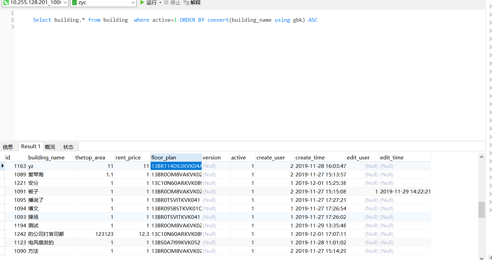

> 时间：2020-12-26  15：32 

# 关于MySql的convert()函数使用

#### 需求：查询楼栋的所有信息（按楼栋名首字母正序排列）

XXXMapper.xml中具体操作数据库代码：

```xml
<!-- 查询楼宇名称列表 -->
	<select id="findAllBuildingName" resultMap="BaseMap">
		Select building.* from building  where active=1 ORDER BY   convert(building_name using gbk) ASC 
	</select>
```

sql语句操作结果：

