>时间：2019-12-20 14：28         wanjiantao

# 消息中间件之ActiveMQ

### 摘要

随着分布式系统的发展，越来越多的公司选择使用消息中间件技术，包括中国一些非常大的互联网企业，例如阿里巴巴的RocketMQ。MQ技术的应用很好的抵挡了一部分系统压力，增加了系统的可靠性，本文就是利用MQ理念的落地产品ActiveMQ作为突破口，来理解MQ的特性和作用，以及了解它对现今一些大型系统的重要性。

对于消息中间件，首先不急于谈ActiveMQ，查询了一下，市面上关于消息中间件的产品非常的多，有Java语言编写，也有其他语言编写的，有用于大数据的大型分布式消息中间件，也有用于中小型微服务的消息中间件，但我认为，只要是消息中间件都是换汤不换药，基本的功能和特征基本相同。

他的特征无外乎包括以下几类：API发送和接收，MQ的高可用性，MQ的集群和容错配置，MQ的持久化，延时发送和定时接收，签收机制，与spring整合等等。它的功能应该包括利用高效可靠的消息传递机制进行与平台无关的数据交流，并基于数据通信来进行分布式系统的集成，通过提供消息传递和消息排队模型在分布式环境下提供应用解耦、弹性伸缩、冗余存储、流量削峰、异步通信、数据同步等。

在谈到ActiveMQ之前，我还想再谈谈MQ的主要功能，其中，最核心的三个功能就是，解耦、削峰、异步。首先就先谈谈①***\*解耦\****的应用场景吧，假如我现在有一个A系统，我需要发送数据给 BCD三个系统，好，发送完了，然而这时E系统也需要这个数据，这时D系统说它不需要了。。。这时候再重新发一次嘛，还是。。很难搞。那么MQ能做什么呢？：A系统发送一条数据到MQ中，如果有其他系统需要这条数据，那么好，你自己去拿，我A系统发完就没我什么事了，我就可以去做其他事了。②***\*削峰\****：我这时候有一个系统它很开心的工作每一天除了晚上9点半到10点的时间，因为这个时间段与其他时间不同，其他时间段每秒可能只有100条数据插入数据库，在这个时间段每秒有4000条数据插入数据库，宝宝心里苦啊，MySQL每秒最多就只能插入2000条，一下每秒4000条数据，它崩了，系统也崩溃了，咋办，找MQ吧，这时我把每秒4000条数据全部放入MQ中，然后MySQL在以每秒2000数据的速度处理，这半个小时过去了，MySQL慢慢的处理着MQ中积压的数据，过了2-3个小时处理完了，系统恢复正常了，它又可以很开心的工作了。

③.***\*异步\****：还是A系统，我要发送一条数据给BCD三个系统，假设我写库需要2ms, BCD分别需要200 300 400ms，这时候木桶效应，一共需要应该是2+400=402ms，假设那一天C系统坏了，需要1000ms，这时候一共1002ms,1秒钟的延迟，一般每个请求需要在200ms以内完成，让用户完全无感知的使用。这时候我们再把 MQ请出来，我发送到MQ大概需要8ms，那么就是8+3=12ms,走过路过不要错过，只需要12ms，我就能响应按钮。非常的迅速。

以上就是我对MQ三个核心功能的理解。

接下来就要讲到ActiveMQ了，为什么我要选择ActiveMQ，首先我并不是非要选择这个技术，我说过只要是MQ，那都是大同小异，没有差别，只不过我认为任何天上乱飞的理论都需要落地的技术实现，再利用任正非先生的一句话：“对着一个城墙口发起冲锋”。我必须要选择一个切入口，对于我这种新手玩家，我认为ActiveMQ是最适合入门学习的。

那么ActiveMQ是如何工作的呢？发送者把消息发送给消息服务器，消息服务器将消息存放在若干队列/主题中，在合适的时候，消息服务器会将消息转发给接受者，在这个过程中，发送和接收是异步的，也就是发送无需等待，而且发送者和接收者的生命周期也没有必要关系，尤其在pub/sub模式下，也可以完成一对多的通信，让一个消费和有多个接收者。

说到MQ在Java中的编码就不得不说JMS编码总体框架，它是Java的消息编码规范，MQ的上层。结构由下列编程示例可知。消息机构由三个核心组成，消息头，消息体，和消息属性

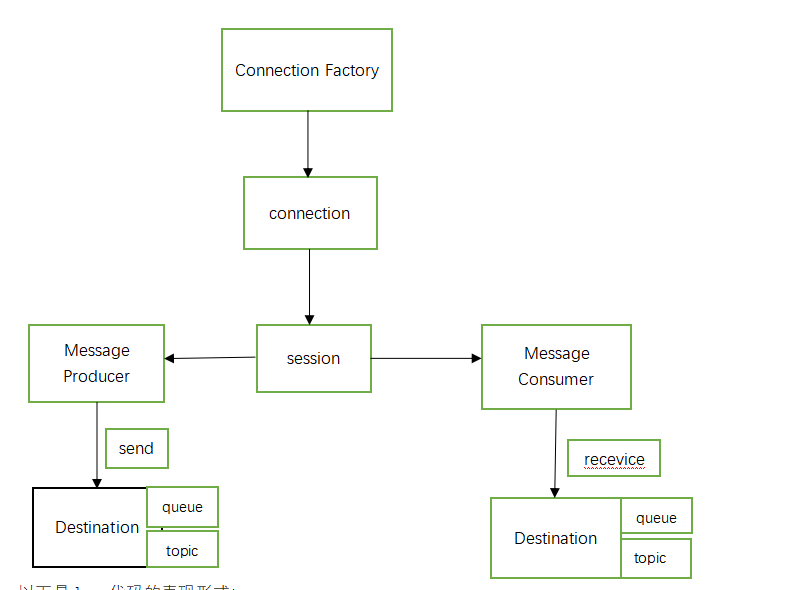 

以下是Java代码的表现形式：

首先步骤1

需要在Linux中启动ActiveMQ，这里我已经在centos6.8中安装和启动了ActiveMQ并关闭了它的防火墙：

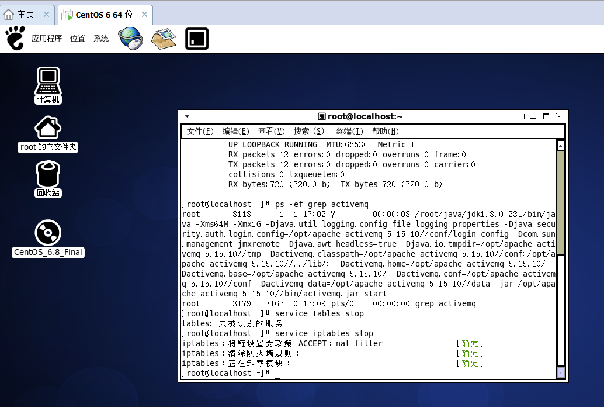 

图表 1centos中截图

接下来即使在Windows电脑中进行编码：

我这里使用的环境是：Windows10  jdk1.8  STS3.9.9.RELEASE  maven3.3.9 

首先是pom.xml中引入的依赖：

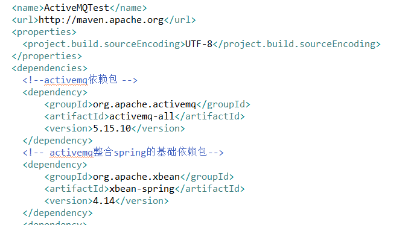 

图表 2ActiveMQ相关依赖

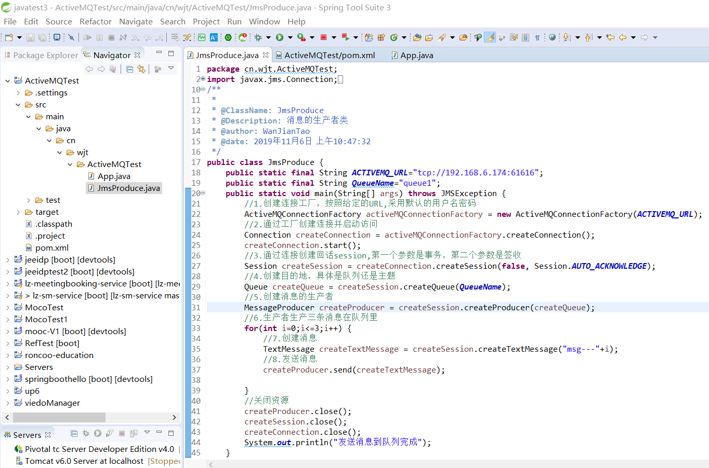 

图表 3消息生产者类

 

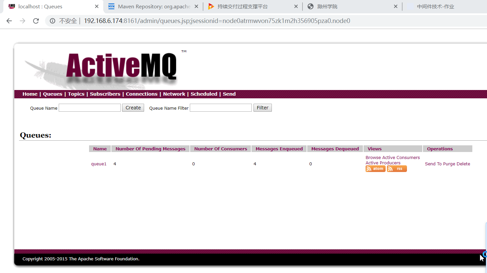 

图表 4此时有4个待处理消息

 

 

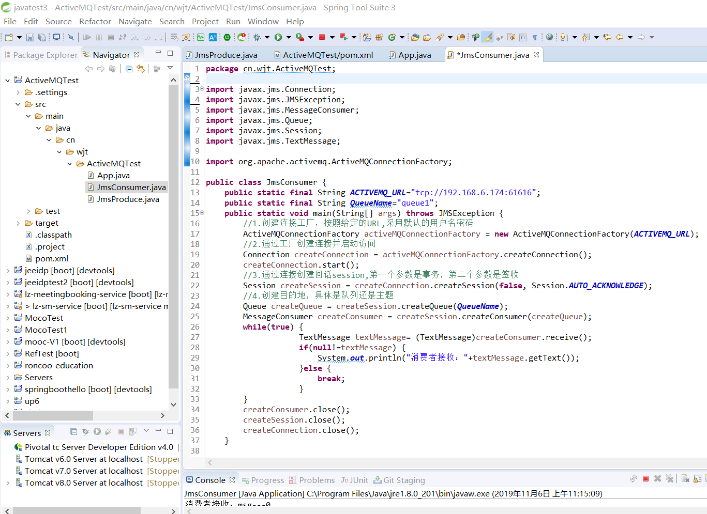 

图表 5消费者类

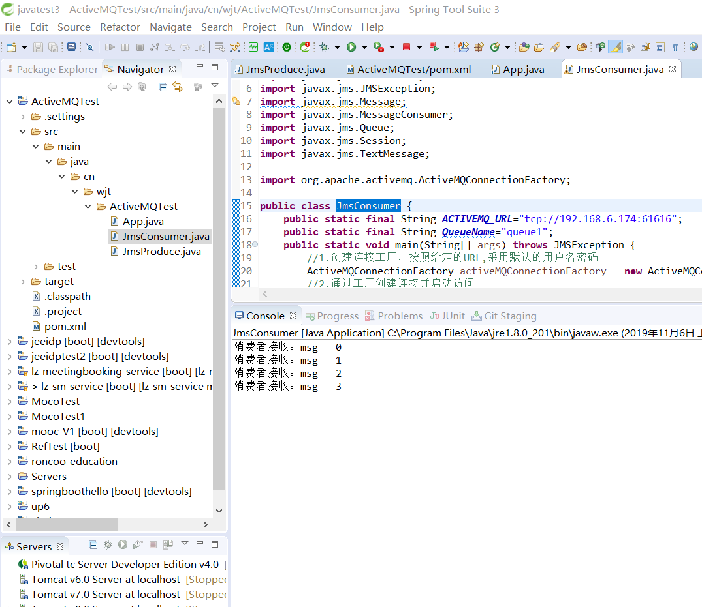 

图表 6消费者运行结果

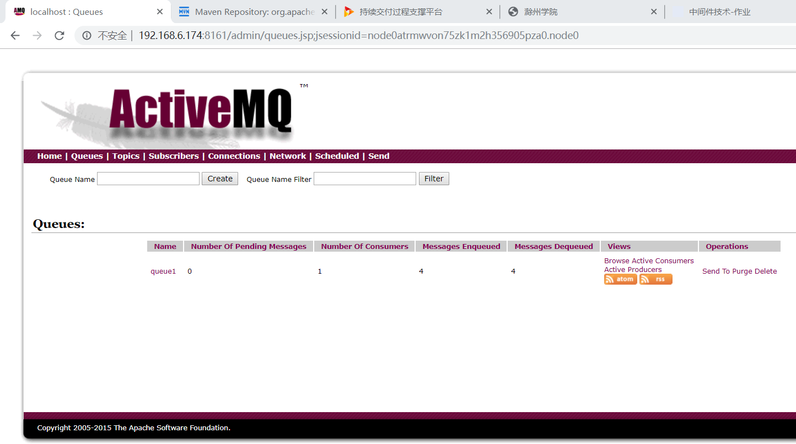 

图表 7此时消费者人数为一

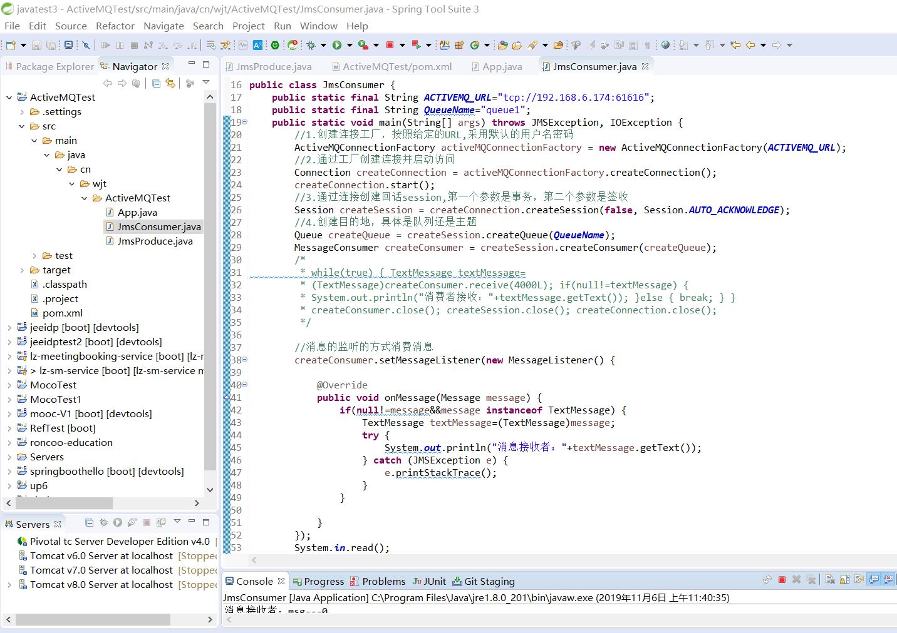 

图表 8 监听器的写法

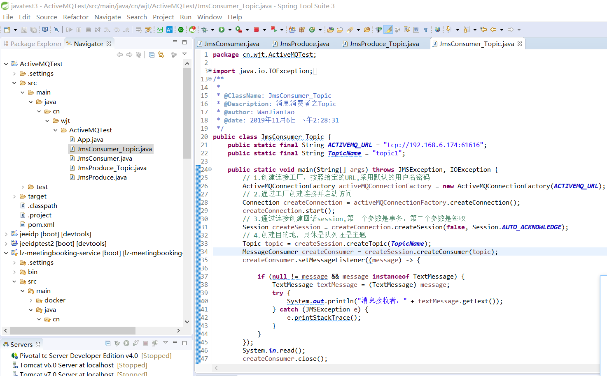 

图表 9消息消费者之topic

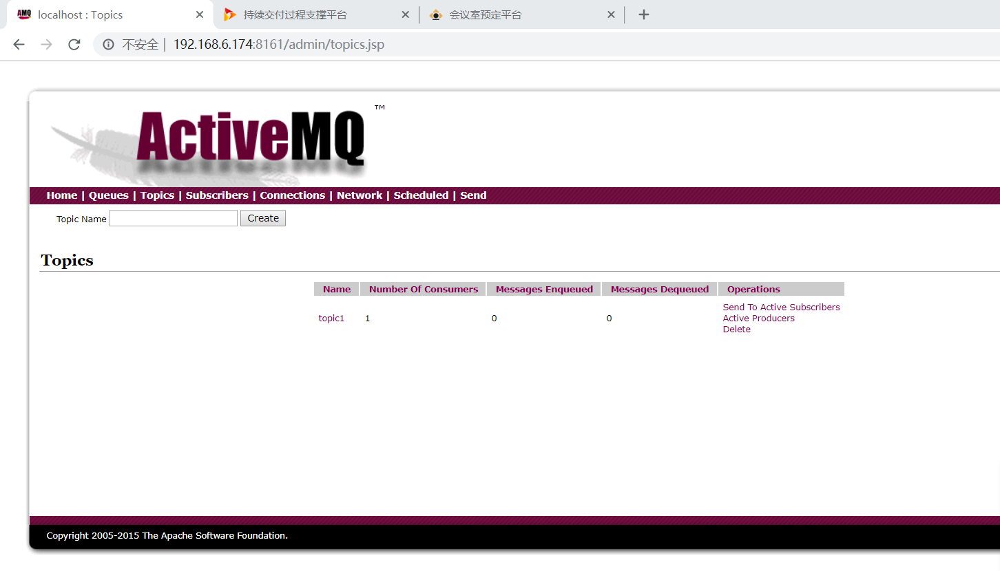 

图表 10此时先开启消费者有一个消费者

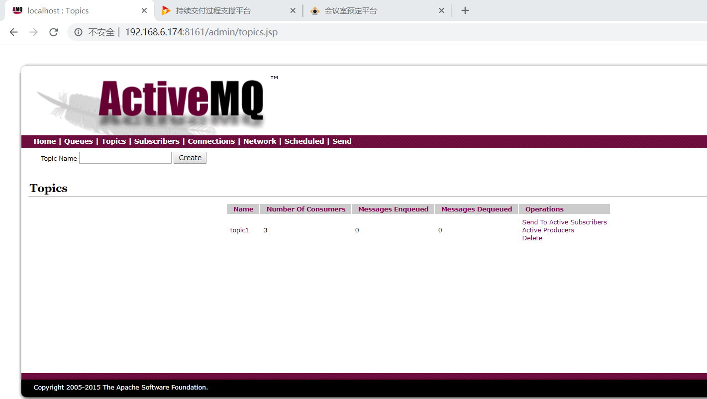 

图表 11启动三次消费者 ，此时有三个消费者等待

 

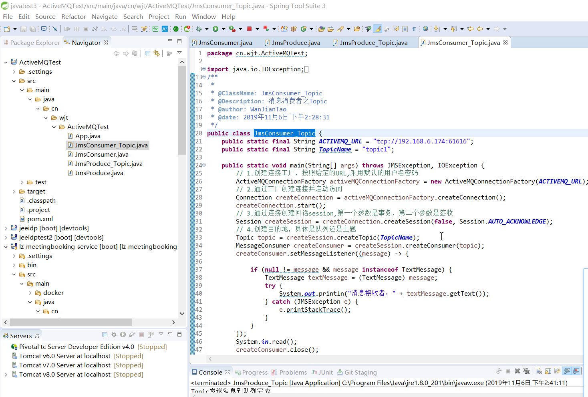 

图表 12 生产者之topic

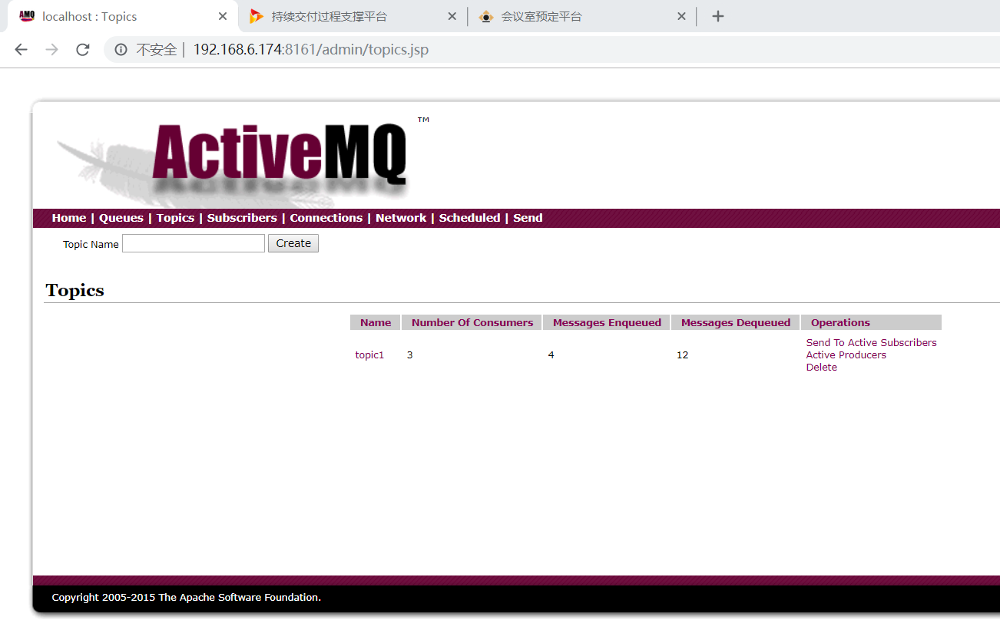 

图表 13当启动生产者，三个消费者均有四条消息

以上是通过编码的方式了解JMS的结构，那么，接下来就要介绍JMS的可靠性了，JMS的可靠性由持久性（Persistence）、事务（Transaction）、签收（AcKnowledge）支持。

首先来说说持久性：持久性的目的时保证程序在运行时，一旦发生意外，例如宕机等，如何保证消息能正常发送接收，能保证持久性的方法有很多，例如JDBC,但思路都是一样的，就是先存储到本地文件，数据库或者远程数据库中，然后在需要的时候再取出来，被消费者消费完后，就进行销毁。

再说说事务和签收：一旦生产生产事务开启，只有commit之后才能将全部消息变为已消费，在事务性会话中，当一个事务被成功提交后，消息会自动签收。如果事务回滚，则消息会被再次传送。在非事务会话中，消息如何签收取决于创建会话时的应答模式（AcKnowledge）

以上就是我以ActiveMQ作为切入点来试图对MQ进行理解。

 

 

 

 

 

【1】张燕;徐立新;ActiveMQ特性与配置研究[J];电脑编程技巧与维;2011(12)

【2】张炜;基于J2EE分布式架构的高性能电商交易接入平台研究与设计[J];移动通信;2011（10）

【3】 戴俊;朱晓民;基于ActiveMQ的异步消息总线的设计与实现[J];计算机系统应用;2010（8）

【4】庞佳丽;分布式系统中基于中间件的异步通信可靠性研究[D];浙江工业大学;2017年

【5】周聪;基于改进的ActiveMQ的通信模型的设计和实现[D];吉林大学;2017年

